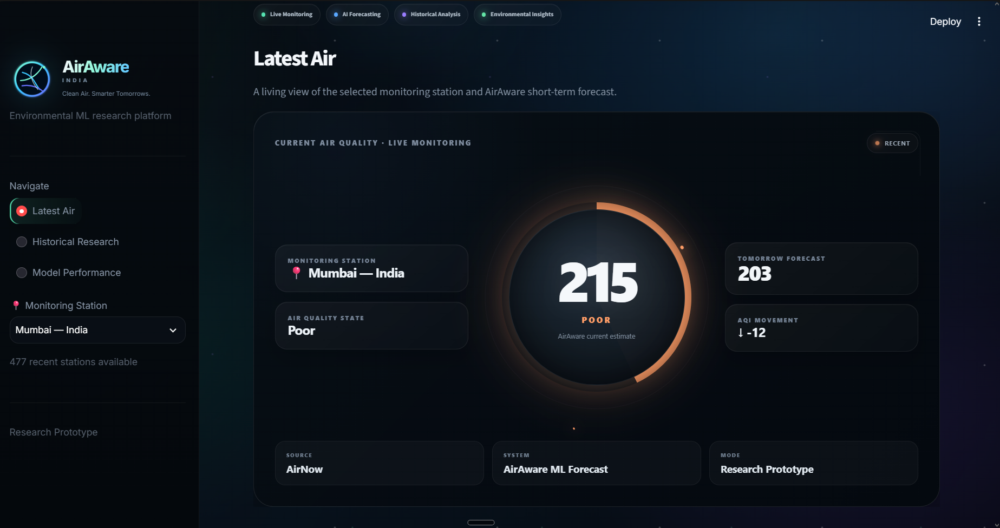
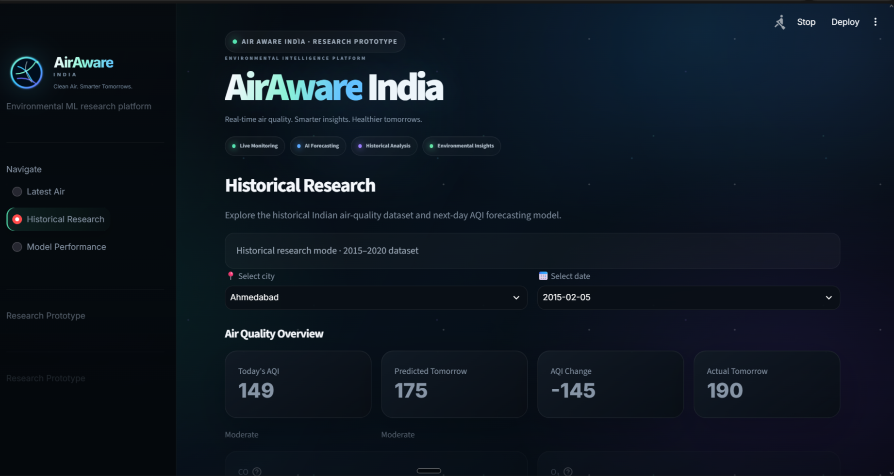

# AirAware India

> **Machine learning for short-term air-quality forecasting and understandable environmental insights.**

AirAware India is a research-oriented environmental ML platform that combines historical Indian air-quality data, short-term AQI forecasting, live monitoring-station data, and a public-facing dashboard.

## Why AirAware?

Air-quality datasets are useful for research, but raw pollutant measurements are difficult for most people to interpret.

AirAware explores whether a lightweight machine-learning model can provide useful **next-day AQI forecasts** while also translating air-quality measurements into simple, understandable environmental information.

## Research Question

> **Can lightweight machine-learning models provide useful short-term air-quality forecasts at local monitoring locations using pollutant and temporal features?**

## What It Does

- Live monitoring-station discovery across India
- Latest pollutant measurements through OpenAQ
- Estimated CPCB-style AQI calculation
- Next-day AQI forecasting with Random Forest
- Historical city-level air-quality exploration
- Pollutant-level breakdowns
- Forecast evaluation
- Model-performance reporting
- Public-facing environmental insights
- Interactive Streamlit dashboard with animated UI

## System Architecture

```text
Historical Indian AQI Data
        │
        ▼
Data Cleaning
        │
        ▼
Feature Engineering
        │
        ▼
Random Forest Forecasting Model
        │
        ├──────────────► Model Evaluation
        │
        ▼
                 AirAware Dashboard
                        ▲
                        │
                 OpenAQ Monitoring
                        │
                        ▼
                 Latest Pollutants
                        │
                        ▼
              Estimated CPCB-style AQI
                        │
                        ▼
                 Short-term Forecast
                        │
                        ▼
              Environmental Insight
```

## Dashboard

### Latest Air



### Historical Research



### Model Performance


## Machine Learning

### Target

The main forecasting task predicts:

**Next_Day_AQI**

### Historical model

**Random Forest Regressor**

The final historical model uses:

- City
- PM2.5
- PM10
- NO2
- CO
- SO2
- O3
- Current AQI
- Previous-day AQI
- 3-day AQI average
- AQI change
- Day
- Month
- Day of week

### Test results

| Metric | Result |
|---|---:|
| Test MAE | **16.20 AQI points** |
| Test R² | **0.883** |
| Baseline MAE | **18.39 AQI points** |

The baseline is a persistence model:

```text
Tomorrow's AQI = Today's AQI
```

**Important:** R² = 0.883 is not "88.3% accuracy."

## Feature Importance

The final Random Forest showed that current AQI was the dominant predictor, followed by PM2.5 and other pollutant/temporal features.

This is consistent with the short-horizon nature of the forecasting problem: today's air-quality state contains substantial information about the following day's conditions.

## Live Monitoring

AirAware uses **OpenAQ** to discover Indian monitoring stations and retrieve recent pollutant observations.

The live pipeline:

```text
OpenAQ
  ↓
Indian monitoring stations
  ↓
Selected station
  ↓
Latest pollutant observations
  ↓
Unit normalization
  ↓
Estimated pollutant sub-indices
  ↓
Estimated CPCB-style AQI
  ↓
AirAware forecast
```

### Important live-data limitation

The live value displayed by AirAware is an **estimated CPCB-style AQI**, not an official CPCB AQI.

Official AQI calculations use prescribed averaging periods and sufficient observations. A latest station measurement may not satisfy those requirements.

The dashboard therefore clearly treats this component as a research prototype.

## Historical Data

The historical model was developed using Indian city-level air-quality observations from **2015–2020**.

The data-processing pipeline includes:

1. Cleaning missing and invalid observations
2. Removing unusable AQI records
3. Normalizing pollutant columns
4. Creating chronological city-level features
5. Creating previous-day AQI
6. Creating a rolling 3-day AQI average
7. Creating AQI change
8. Creating calendar features
9. Creating a true next-day prediction target

## Project Structure

```text
AirAware-India/
│
├── app.py
├── README.md
├── requirements.txt
├── .env.example
├── .gitignore
│
├── data/
│   ├── cleaned_city_day.csv
│   └── ml_data.csv
│
├── docs/
│   └── screenshots/
│
├── models/
│   ├── airaware_random_forest_v3.joblib
│   └── airaware_live_rf.joblib
│
├── reports/
│   ├── actual_vs_predicted.png
│   ├── aqi_distribution.png
│   ├── average_aqi_by_city.png
│   └── pm25_vs_aqi.png
│
└── src/
    ├── clean_data.py
    ├── eda.py
    ├── prepare_ml_data.py
    ├── train_model.py
    ├── train_live_model.py
    ├── evaluate_baseline.py
    ├── evaluate_predictions.py
    ├── feature_importance.py
    ├── city_evaluation.py
    ├── live_air.py
    └── live_forecast.py
```

## Tech Stack

**Machine Learning**
- Python
- Pandas
- NumPy
- Scikit-learn
- Joblib

**Data**
- Historical Indian air-quality data
- OpenAQ API

**Application**
- Streamlit
- HTML/CSS
- JavaScript
- Three.js
- GSAP

## Run Locally

### 1. Clone

```bash
git clone https://github.com/aaravpachouri/AirAware-India.git
cd AirAware-India
```

### 2. Create a virtual environment

Windows:

```powershell
python -m venv .venv
.venv\Scripts\activate
```

### 3. Install dependencies

```powershell
pip install -r requirements.txt
```

### 4. Configure OpenAQ

```powershell
copy .env.example .env
```

Add your own key:

```env
OPENAQ_API_KEY=your_openaq_api_key
```

Never commit `.env`.

### 5. Run the application

```powershell
streamlit run app.py
```

## Research Pages

### Latest Air

Shows:

- Selected monitoring station
- Latest pollutant measurements
- Estimated AQI
- AQI category
- Tomorrow's predicted AQI
- AQI movement
- Pollutant sub-indices
- Environmental guidance

### Historical Research

Allows exploration of:

- Historical city/date observations
- Current AQI
- Predicted next-day AQI
- Actual next-day AQI where available
- Prediction error
- Recent AQI trend

### Model Performance

Documents:

- Model type
- MAE
- R²
- Feature set
- Research limitations

## Reports

The `reports/` directory contains the main research visualizations:

- AQI distribution
- Average AQI by city
- PM2.5 vs AQI
- Actual vs predicted AQI

## Limitations

AirAware is intentionally presented as an experimental research prototype.

Current limitations include:

- Historical training data is city-level
- Live monitoring data can be delayed
- Live point measurements do not necessarily satisfy official AQI averaging requirements
- The historical model is optimized for short-term forecasting rather than long-range prediction
- Performance varies by city
- A strong persistence baseline means short-term AQI prediction is inherently challenging

## Future Research

Potential extensions include:

- More rigorous temporal and city-level validation
- Additional meteorological features
- Stronger baseline comparisons
- Probabilistic forecasting
- Multi-step forecasting
- Better handling of missing observations
- Station-specific modelling
- Broader public-health communication research

## Portfolio Context

AirAware India is part of a broader progression of AI/ML projects:

```text
JARVIS X
Software Engineering + AI Agents
        ↓
RAG Model
Retrieval + NLP + Multimodal AI
        ↓
AirAware India
Machine Learning + Forecasting + Environmental Impact
        ↓
Future Flagship AI Model
Model Training + Evaluation + Open Research
```

## Status

**Current status: Public research prototype**

The project is deployed as an interactive Streamlit application and maintained as an open-source research/engineering project.

## License

Add the project's final license here before publication.

---

**Built by Aarav Pachouri**
